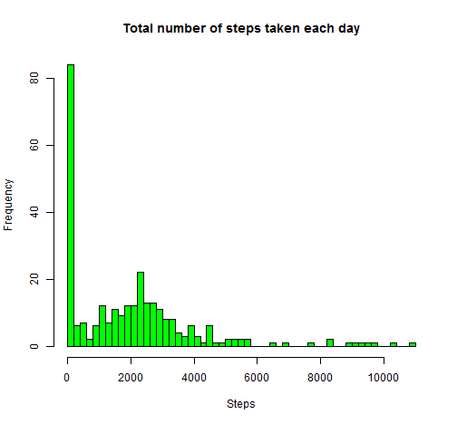
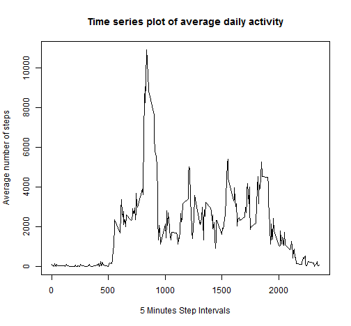
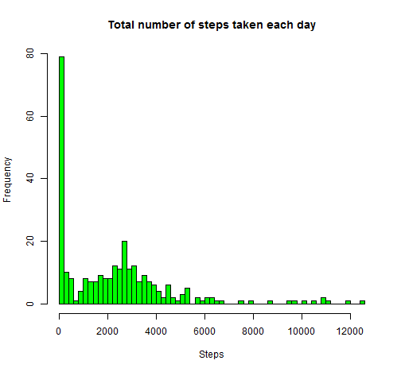

# Reproducible Research: Peer Assessment 1
## Introduction

This assignment makes use of data from a personal activity monitoring device. This device collects data at 5 minute intervals through out the day. The data consists of two months of data from an anonymous individual collected during the months of October and November, 2012 and include the number of steps taken in 5 minute intervals each day.

## Loading and preprocessing the data


```r
# NOTE: the command below needed to change to point to the working
# directory, which contains activity.csv file.
# setwd('C:\\Users\\Tony\\dataScience1\\RepData_PeerAssessment1')

# read the dataset
data <- read.csv("./activity.csv")
data1 <- na.omit(data)
steps_mean <- aggregate(data1$steps, by = list(data1$interval), FUN = sum)
# dim(steps_mean) #[1] 288 2 rename the columns names of steps_mean to more
# meaningful names.
colnames(steps_mean) <- c("interval", "average_steps_all_days")
```


## What is mean total number of steps taken per day?

The histogram below shows the total number of steps taken each day:


```r
hist(steps_mean$average_steps_all_days, breaks = 61, col = "green", xlab = "Steps", 
    main = "Total number of steps taken each day")
```

 


The **mean** and **median** total number of steps taken per day is calculate using function mean() and median() accordingly.

```r
mean(steps_mean$average_steps_all_days, na.rm = T)
```

```
## [1] 1981
```

```r
median(steps_mean$average_steps_all_days, na.rm = T)
```

```
## [1] 1808
```


## What is the average daily activity pattern?

The time series plot below shows the 5-minute interval (x-axis) vs. the average number of steps taken, averaged across all days (y-axis):

```r
plot(steps_mean$interval, steps_mean$average_steps_all_days, type = "l", xlab = "5 Minutes Step Intervals", 
    ylab = "Average number of steps", main = "Time series plot of average daily activity")
```

 

The command below shows the the maximum number of steps "10927" occurs in the 5-minute internal of "835".


```r
subset(steps_mean, average_steps_all_days == max(steps_mean$average_steps_all_days))
```

```
##     interval average_steps_all_days
## 104      835                  10927
```

## Imputing missing values

The total number of rows has missing value (NA) in the dataset is 2304 as show by the command below:

```r
sum(is.na(data))
```

```
## [1] 2304
```


The missing value in the dataset will be replaced with the mean of each 5 minute interval, using the R code below.


```r
# subset the steps and internal columns
data2 <- data1[, c("steps", "interval")]

library(reshape2)
```

```
## Warning: package 'reshape2' was built under R version 3.0.3
```

```r
# use melt and dcat to calculate the mean of each 5 minute interval.
mdata <- melt(data2, id.vars = c("interval"))
cdata <- dcast(mdata, interval ~ variable, mean)
# colnames(cdata) <- c('interval', 'average_steps_intervals')

# find out which rows contains NA.
na_rows <- which(is.na(data))

# extend cdata to have the same length as data, (i.e. 17568/288=61)
ncdata <- do.call("rbind", replicate(61, cdata, simplify = FALSE))
# extra the colum steps only.
int_steps <- ncdata[, c("steps"), drop = FALSE]

# replace NA with average_steps_intervals.
data3 <- data
data3[na_rows, c("steps")] <- int_steps[na_rows, ]
```


The histogram below shows the total number of steps taken each day of the new filled dataset:

```r
steps_mean2 <- aggregate(data3$steps, by = list(data3$interval), FUN = sum)
# dim(steps_mean2) #[1] 288 2 rename the columns names of steps_mean to more
# meaningful names.
colnames(steps_mean2) <- c("interval", "average_steps_all_days")
hist(steps_mean2$average_steps_all_days, breaks = 61, col = "green", xlab = "Steps", 
    main = "Total number of steps taken each day")
```

 


The **mean** and **median** total number of steps taken per day of the new dataset is calculate using function mean() and median() accordingly.


```r
mean(steps_mean2$average_steps_all_days, na.rm = T)
```

```
## [1] 2280
```

```r
median(steps_mean2$average_steps_all_days, na.rm = T)
```

```
## [1] 2081
```

By inspect the historgram plots of the original dataset and the new filled dataset, one can see there are some difference between them, and one can clearly see the difference between them by compare the first fifteen numbers of the datasets as show below:


```r
round(head(steps_mean$average_steps_all_days, 15))
```

```
##  [1]  91  18   7   8   4 111  28  46   0  78  16   7  17  36   8
```

```r
round(head(steps_mean2$average_steps_all_days, 15))
```

```
##  [1] 105  21   8   9   5 128  32  53   0  90  18   8  20  41   9
```


The **mean** and **median** total number of steps taken per day of the orignal dataset and the new dataset are slighly differnece, and they are: 1981.278, 1808 and 2280.339, 2080.906 respectively.

There are some impact of imputing missing data on the estimates of the total daily number of steps as show in the historgrams, but the overall sharp of the historgram remain similar.

## Are there differences in activity patterns between weekdays and weekends?

The codes below create a new factor variable called "weekdays" and add it into the new dataset call "data3"

```r
wd <- data3$date
wd <- strptime(wd, "%Y-%m-%d")
data3$weekdays <- weekdays(wd)

data3[data3$weekdays == "Saturday" | data3$weekdays == "Sunday", c("weekdays")] <- "weekend"
data3[data3$weekdays != "weekend", c("weekdays")] <- "weekday"
# turn weekdays into a factor variable
data3$weekdays <- as.factor(data3$weekdays)
head(data3)
```

```
##     steps       date interval weekdays
## 1 1.71698 2012-10-01        0  weekday
## 2 0.33962 2012-10-01        5  weekday
## 3 0.13208 2012-10-01       10  weekday
## 4 0.15094 2012-10-01       15  weekday
## 5 0.07547 2012-10-01       20  weekday
## 6 2.09434 2012-10-01       25  weekday
```

```r
tail(data3)
```

```
##        steps       date interval weekdays
## 17563 2.6038 2012-11-30     2330  weekday
## 17564 4.6981 2012-11-30     2335  weekday
## 17565 3.3019 2012-11-30     2340  weekday
## 17566 0.6415 2012-11-30     2345  weekday
## 17567 0.2264 2012-11-30     2350  weekday
## 17568 1.0755 2012-11-30     2355  weekday
```

The codes below create a panel plot containing a time series plot of the 5-minute interval (x-axis) and the average number of steps taken, averaged across all weekday days or weekend days (y-axis). One can see there are difference activity patterns between weekdays and weekends


```r
# use melt and dcat to calculate the mean of each 5 minute interval.
mdata3 <- melt(data3, id.vars = c("interval", "weekdays", "date"))
cdata3 <- dcast(mdata3, interval + weekdays ~ variable, mean)

library(lattice)
```

```
## Warning: package 'lattice' was built under R version 3.0.3
```

```r
# xyplot(interval ~ steps | weekdays, data=cdata3, type='l', layout =c(1,2))
xyplot(steps ~ interval | weekdays, data = cdata3, type = "l", layout = c(1, 
    2), xlab = "Interval", ylab = "Number of steps")
```

 

